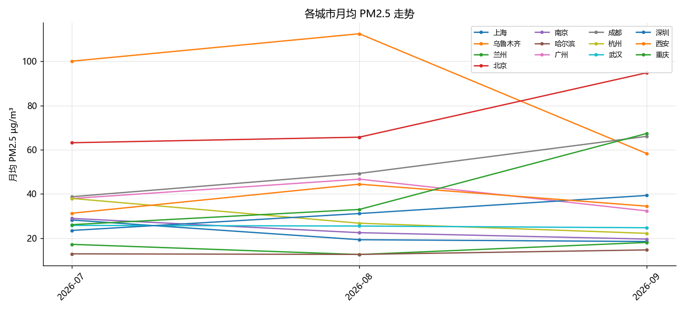

# dataforge 数据日报

> 生成时间：2026-09-13 15:59　|　数据源：Open-Meteo（CAMS 再分析）

## KPI

- 城市数: 13
- 气象覆盖天数: 60
- 最新数据日: 2026-09-06
- 期间均温: 27.7
- 期间 PM2.5 均值: 37.8

## 城市 PM2.5 排名（期间均值）

| 城市 | PM2.5 µg/m³ |
|---|---|
| 乌鲁木齐 | 102.3 |
| 北京 | 67.6 |
| 成都 | 46.9 |
| 广州 | 41.9 |
| 西安 | 38.4 |
| 重庆 | 33.8 |
| 杭州 | 30.6 |
| 深圳 | 29.0 |
| 武汉 | 25.5 |
| 南京 | 24.6 |
| 上海 | 22.6 |
| 兰州 | 14.9 |
| 哈尔滨 | 12.9 |

